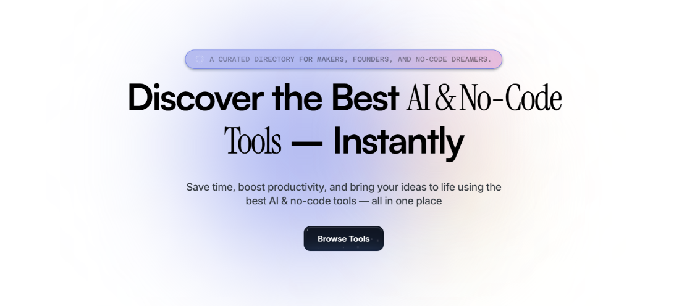

<!-- Banner -->

  

  A curated collection of the best <strong>no-code AI tools</strong> for makers, builders, and creators.  
  Discover, explore, and contribute to the future of AI-powered productivity.

---

## 🚀 About This Project

Welcome to the **NoCode AI Tool Directory**!  
This is a community-driven, open-source collection of AI-powered tools that **don't require code to use** — perfect for indie hackers, designers, entrepreneurs, and anyone who loves to build without code.

Whether you're building content, automating workflows, or generating images, this repo has you covered.

---

## 💡 Why Use This Repo?

This is your **one-stop directory** for powerful AI tools that **require zero code**.  
Ideal for:
- 🧑‍💻 Indie makers launching fast
- 🎨 Designers prototyping smartly
- 🚀 Startups saving time and money
- ✨ Builders experimenting with AI

Use it to explore tools, plan projects, validate ideas, and automate workflows — all without writing a single line of code.

---

## 🧩 Tool Categories

> We'll keep updating this — feel free to [contribute](#-contribute) your favorites!

## 🧠 Idea & Market Research
**Use Case: Finding & Validating a SaaS Idea**

| Logo | Tool Name | Price | Description | Link |
|------|-----------|-------|-------------|------|
| 🧠 | ChatGPT / Claude | Free / Paid | Brainstorming ideas and getting insights | [ChatGPT / Claude](https://chat.openai.com) |
| 📈 | Trends.vc | Paid | Researching emerging market trends | [Trends.vc](https://trends.vc) |
| 📊 | Exploding Topics | Free / Paid | Identifying trending business opportunities | [Exploding Topics](https://explodingtopics.com) |
| 📋 | SurveyMonkey / Typeform | Free / Paid | Validating ideas with surveys | [SurveyMonkey](https://www.surveymonkey.com) / [Typeform](https://www.typeform.com) |
| 🔍 | Google Trends | Free | Checking market demand for your idea | [Google Trends](https://trends.google.com) |

---

## 🛠️ No-Code Development & Automation
**Building SaaS Without Code**

| Logo | Tool Name | Price | Description | Link |
|------|-----------|-------|-------------|------|
| 🧱 | Bubble | Free / Paid | No-code web app builder | [Bubble](https://bubble.io) |
| 📱 | Glide | Free / Paid | Create SaaS products using Google Sheets | [Glide](https://www.glideapps.com) |
| 📲 | Thunkable / Adalo | Free / Paid | No-code mobile app builders | [Thunkable](https://thunkable.com) / [Adalo](https://www.adalo.com) |
| 🌐 | Webflow | Free / Paid | No-code website builder | [Webflow](https://webflow.com) |
| 🎞️ | Framer | Free / Paid | Modern website builder with animations | [Framer](https://www.framer.com) |
| 💖 | Lovable | Free | AI-powered design-to-site builder | [Lovable](https://www.lovable.com) |
| ⚡ | Bolt | Free | Lightweight landing page builder | [Bolt.new](https://bolt.new) |
| 🧩 | Softr | Free / Paid | Turn Airtable into SaaS apps | [Softr](https://www.softr.io) |
| 🔧 | Xano | Free / Paid | No-code backend development | [Xano](https://xano.com) |

---

## Automating Workflows

| Logo | Tool Name | Price | Description | Link |
|------|-----------|-------|-------------|------|
| 🔗 | Zapier | Free / Paid | Automate workflows between apps | [Zapier](https://zapier.com) |
| 🔄 | Make (Integromat) | Free / Paid | Advanced automation and integrations | [Make](https://www.make.com) |
| 🌐 | Pipedream | Free / Paid | Serverless workflows for automation | [Pipedream](https://pipedream.com) |

---

## 🎨 UI/UX Design & Prototyping

| Logo | Tool Name | Price | Description | Link |
|------|-----------|-------|-------------|------|
| 🎨 | Figma | Free / Paid | Collaborative UI/UX design tool | [Figma](https://www.figma.com) |
| 🎞️ | Framer | Free / Paid | No-code website builder with animations | [Framer](https://www.framer.com) |
| ✏️ | Uizard | Free / Paid | AI-powered UI design from sketches | [Uizard](https://www.uizard.io) |
| 🖼️ | Midjourney / DALL·E | Paid | Generate UI/UX inspiration | [Midjourney](https://www.midjourney.com) / [DALL·E](https://openai.com/dall-e) |

---

## 🔧 AI-Powered SaaS Features

| Logo | Tool Name | Description | Link |
|------|-----------|-------------|------|
| 🤖 | OpenAI API | Build AI features into apps | [OpenAI](https://openai.com/api) |
| 🧠 | Hugging Face | Open-source AI models | [Hugging Face](https://huggingface.co) |
| 🔁 | Replicate | AI model hosting for SaaS products | [Replicate](https://replicate.com) |
| 🧰 | Vellum | No-code AI model builder | [Vellum](https://www.vellum.ai) |
| ⚙️ | Superflows | AI-powered workflows in SaaS | [Superflows](https://www.superflows.io) |

---

## 🗄️ Backend & Database Management

| Logo | Tool Name | Price | Description | Link |
|------|-----------|-------|-------------|------|
| 🗃️ | Supabase | Free / Paid | Open-source Firebase alternative | [Supabase](https://supabase.io) |
| 📊 | Airtable | Free / Paid | Database for no-code apps | [Airtable](https://airtable.com) |
| 🔥 | Firebase | Free / Paid | Scalable backend for web & mobile apps | [Firebase](https://firebase.google.com) |
| 🐘 | PostgreSQL / MySQL | Free | Traditional databases | [PostgreSQL](https://www.postgresql.org) / [MySQL](https://www.mysql.com) |

---

## 💳 Payment & Subscription Management

| Logo | Tool Name | Price | Description | Link |
|------|-----------|-------|-------------|------|
| 💳 | Stripe | Paid | Payment processing for SaaS | [Stripe](https://stripe.com) |
| 🧾 | Paddle | Paid | Subscription billing without tax headaches | [Paddle](https://paddle.com) |
| 🍋 | Lemon Squeezy | Paid | No-code payment integration | [Lemon Squeezy](https://www.lemonsqueezy.com) |

---

## 📈 Growth, Marketing & SEO

| Logo | Tool Name | Price | Description | Link |
|------|-----------|-------|-------------|------|
| ✍️ | ChatGPT (for copywriting) | Free / Paid | AI-powered marketing content | [ChatGPT](https://chat.openai.com) |
| 📝 | Jasper AI / Copy.ai | Paid | AI content & blog writing | [Jasper](https://www.jasper.ai) / [Copy.ai](https://www.copy.ai) |
| 🔍 | Surfer SEO | Paid | Optimizing content for search engines | [Surfer SEO](https://surferseo.com) |
| 📈 | Ahrefs / SEMrush | Paid | SEO keyword research & analytics | [Ahrefs](https://ahrefs.com) / [SEMrush](https://www.semrush.com) |
| 🖥️ | Carrd | Free / Paid | Simple one-page websites | [Carrd](https://carrd.co) |
| 📧 | Beehiiv / ConvertKit | Free / Paid | Email marketing automation | [Beehiiv](https://www.beehiiv.com) / [ConvertKit](https://convertkit.com) |

---

## 📊 Analytics & User Behavior Tracking

| Logo | Tool Name | Price | Description | Link |
|------|-----------|-------|-------------|------|
| 📊 | Google Analytics | Free | Website traffic insights | [Google Analytics](https://analytics.google.com) |
| 📈 | Mixpanel | Free / Paid | User behavior analytics | [Mixpanel](https://mixpanel.com) |
| 🔥 | Hotjar | Free / Paid | Heatmaps & session recordings | [Hotjar](https://www.hotjar.com) |
| 🐗 | PostHog | Free / Paid | Open-source product analytics | [PostHog](https://posthog.com) |

---

## 👨‍💻 Customer Support & Chatbots

| Logo | Tool Name | Price | Description | Link |
|------|-----------|-------|-------------|------|
| 💬 | Intercom | Paid | Live chat & customer engagement | [Intercom](https://www.intercom.com) |
| 🤖 | Drift | Paid | AI-powered chatbots | [Drift](https://www.drift.com) |
| 🗨️ | Tidio | Free / Paid | No-code chatbot for SaaS | [Tidio](https://www.tidio.com) |
| 🎟️ | Zendesk | Paid | Customer support ticketing system | [Zendesk](https://www.zendesk.com) |

---

## 📢 Community & User Engagement

| Logo | Tool Name | Price | Description | Link |
|------|-----------|-------|-------------|------|
| 👥 | Circle.so | Paid | Community platform for SaaS | [Circle](https://www.circle.so) |
| 💬 | Discord / Slack | Free / Paid | Engage with users & provide support | [Discord](https://discord.com) / [Slack](https://slack.com) |
| 🚀 | Betalist / Product Hunt | Free | Launch your product to an audience | [Betalist](https://betalist.com) / [Product Hunt](https://www.producthunt.com) |

---

<!-- Star Banner -->

  

 
